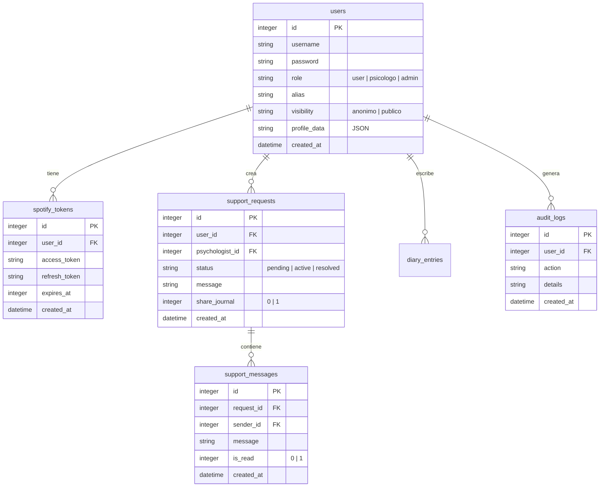
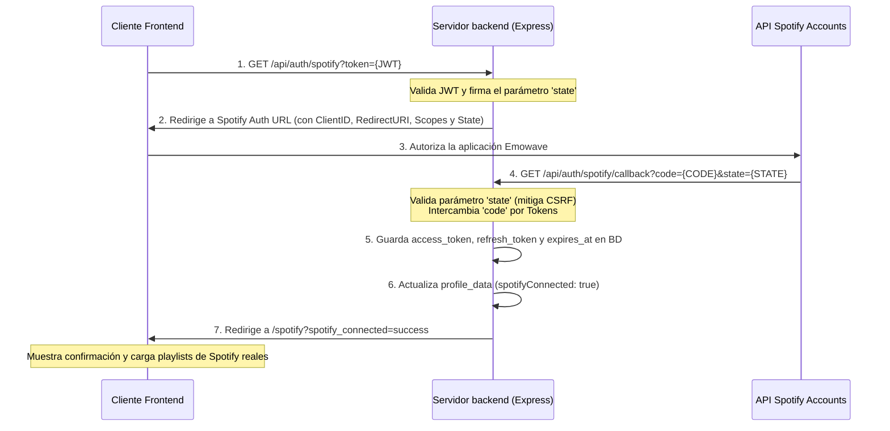

# Arquitectura del Sistema Emowave 🧘‍♀️

Este documento describe la arquitectura de producción de **Emowave**, abarcando su flujo de datos, esquema de base de datos, seguridad, integración de Spotify OAuth 2.0 y el chat de soporte psicológico confidencial.

---

## 📁 Estructura del Sistema

Emowave sigue una arquitectura limpia (Clean Architecture) adaptada para un entorno Full Stack:

1. **Capa de Datos**: Base de datos SQLite persistente gestionada mediante `better-sqlite3` en el backend, con migraciones automáticas que garantizan la integridad referencial y de claves foráneas.
2. **Capa de Servidor**: Servidor Node.js + Express que implementa control de acceso basado en roles (RBAC) mediante JWT y validación exhaustiva de peticiones.
3. **Capa de Cliente**: Aplicación SPA interactiva construida con React, TanStack Start (Vite) y TypeScript. Utiliza un context de estado global centralizado (`MoodProvider`) para sincronizar la UI con la sesión, el estado de soporte y la integración de Spotify.

---

## 📊 Modelo de Datos (SQLite)

La persistencia del sistema está modelada en la base de datos de producción SQLite con las siguientes relaciones:

### Índices de Rendimiento
Para acelerar las consultas frecuentes, la base de datos incluye los siguientes índices:
- `idx_spotify_user` sobre `spotify_tokens(user_id)`
- `idx_support_user` sobre `support_requests(user_id)`
- `idx_support_status` sobre `support_requests(status)`
- `idx_support_messages_req` sobre `support_messages(request_id)`

---

## 🔐 Flujo de Autenticación Spotify OAuth 2.0

Para reemplazar la simulación de playlists, se implementó el flujo seguro de Spotify OAuth 2.0.

### 🔄 Diagrama del Flujo de Conexión

### Renovación Automática de Tokens
Antes de cada llamada para consultar playlists reales (`GET /api/spotify/playlists`), el backend evalúa si el token actual de Spotify ha expirado (o expirará en los próximos 60 segundos). Si es así, realiza una petición directa al endpoint de refresco de tokens de Spotify utilizando el `refresh_token` guardado en la base de datos, renovándolo de forma transparente para el usuario sin interrumpir su experiencia.

---

## 💬 Sistema de Soporte Psicológico

El flujo del chat de apoyo psicológico garantiza la confidencialidad y el control del paciente sobre su información:

1. **Consentimiento**: Al crear la solicitud, el usuario debe aceptar el consentimiento de privacidad y decidir si comparte voluntariamente las últimas 5 entradas de su diario emocional (`share_journal`).
2. **Asignación**: Las solicitudes quedan en estado `pending`. Cuando un psicólogo (o administrador) selecciona el caso e interactúa enviando un mensaje, el sistema le asigna automáticamente el caso al profesional y el estado cambia a `active`.
3. **Conversación**: Utiliza un sistema robusto de intercambio de mensajes. Un polling continuo de 10 segundos en el cliente frontend refresca la conversación automáticamente. Se ha estructurado la API para permitir la migración directa a WebSockets/SSE en el futuro.
4. **Resolución**: Tanto el usuario como el psicólogo pueden dar por resuelto el caso, desactivándolo de la lista de casos activos y deteniendo el intercambio de mensajes.

---

## 🛡️ Auditoría Administrativa y Seguridad OWASP

Siguiendo las mejores prácticas de la Guía de Seguridad OWASP:
- **Prevención de XSS**: Los mensajes del chat de soporte se sanitizan en el backend antes de ser insertados y renderizados en la UI.
- **Auditoría**: Cada vez que un administrador aprueba, rechaza o edita un post de la comunidad, la acción se registra de forma inmutable en la tabla `audit_logs`. Esta tabla se visualiza en la pestaña de Auditoría exclusiva para roles `admin` en el panel profesional.
- **Inyecciones SQL**: La totalidad de las interacciones con la base de datos utilizan placeholders de SQLite, neutralizando inyecciones de código SQL.
